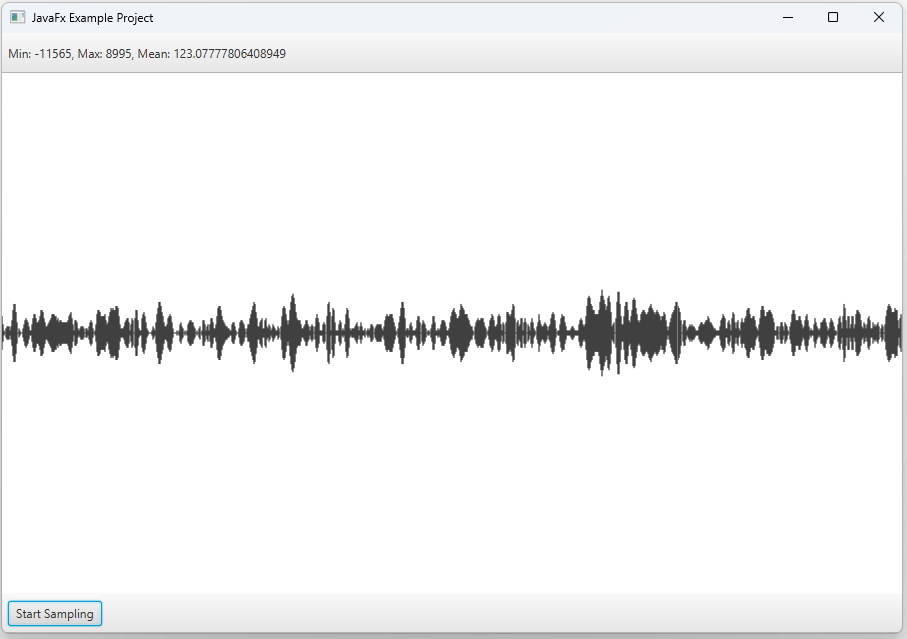

# An Example JFX Application

This app samples audio raw PCM data and converts it to graphics on canvas. 

This project is in a very early stage. It is aimed to add noise profile 
analysis feature using algorithms such as Fast Fourier Transform (FFT).

# How it works?
Samples audio data as 2 bytes (16 bits) from microphone  as little-endian 
short data type. And visualizes samples on canvas.

# License
The Unlicense. Feel free to use or change it how you need.
